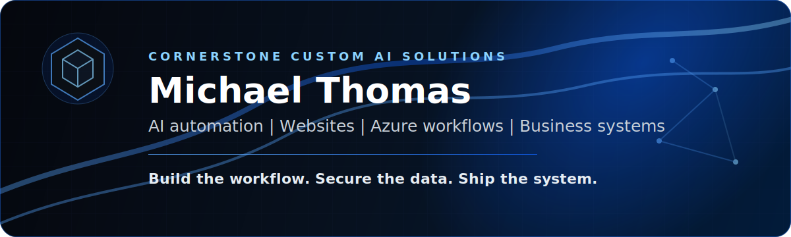

  

# Michael Thomas

### Founder, Cornerstone Custom AI Solutions

I build practical automation, websites, and cloud workflows for businesses that need cleaner operations, better lead handling, and systems that can actually be run day to day.

  
  
  

---

## What I Build

- **AI workflow automation:** intake, routing, follow-up, summaries, alerts, and human review queues.
- **Websites and conversion systems:** WordPress/Kinsta sites, landing pages, forms, SEO pages, and lead paths.
- **Cloud integrations:** Azure Functions, queues, Key Vault, APIs, webhooks, email delivery, and monitoring.
- **Delivery systems:** Terraform, GitHub Actions, customer setup playbooks, QA checklists, and support notes.

## How I Work

I start with the workflow, ship a small pilot, test it with real users, then harden it with security, alerts, documentation, and support steps.

Current focus:

- Building Cornerstone Custom AI Solutions into a practical automation company.
- Turning client problems into repeatable service packages.
- Keeping humans in the loop where accuracy, customer experience, or liability matters.

## Tools

  
  
  
  
  
  
  
  
  
  
  
  

## GitHub

Most production work is private because it contains client operations, credentials, and internal process details. Public repositories will focus on reusable examples, infrastructure patterns, and safe templates.

  
  

## Contact

- Website: [cornerstonecustomai.com](https://cornerstonecustomai.com)
- Email: [michael@cornerstonecustomai.com](mailto:michael@cornerstonecustomai.com)
