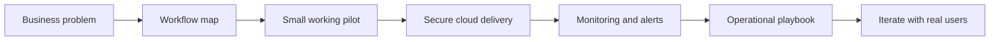

  

# Michael Thomas

### Founder of Cornerstone Custom AI Solutions

I build practical automation systems for businesses that need cleaner operations, better customer intake, stronger websites, and reliable cloud delivery.

  
  
  

---

## What I Do

<table>
  <tr>
    <td width="50%">
      <h3>AI and Workflow Automation</h3>
      
Turn repetitive intake, follow-up, routing, reporting, and review work into structured systems with clear human checkpoints.

    </td>
    <td width="50%">
      <h3>Websites and Conversion Systems</h3>
      
Improve websites, landing pages, forms, SEO content, calls to action, and lead flows so marketing connects to real operations.

    </td>
  </tr>
  <tr>
    <td width="50%">
      <h3>Cloud Integrations</h3>
      
Connect tools with APIs, webhooks, serverless functions, queues, alerts, and secure secret handling instead of fragile manual handoffs.

    </td>
    <td width="50%">
      <h3>Business Systems</h3>
      
Create documentation, testing checklists, support processes, deployment pipelines, and playbooks so solutions can be repeated.

    </td>
  </tr>
</table>

## How I Build

## Current Focus

- Building Cornerstone Custom AI Solutions as a practical AI automation company.
- Creating repeatable service packages for local businesses, medical practices, and professional teams.
- Improving websites, funnels, lead handling, and back-office workflows.
- Turning one-off client problems into documented systems that can be delivered repeatedly.

## Example Systems

- Website form to qualified lead workflow
- Missed-call or after-hours intake assistant
- Appointment or service request routing
- Medical practice intake and staff review queues
- Cloud email delivery and notification pipelines
- Infrastructure-as-code and deployment pipelines
- Internal operating docs, launch checklists, and customer setup playbooks

## Tools I Work With

  
  
  
  
  
  
  
  
  
  

## Operating Principles

- Start with the business process before choosing the AI tool.
- Build small pilots that can be tested with real users and real workflows.
- Keep human review in the loop for sensitive, expensive, or high-impact decisions.
- Use structured outputs, alerts, and logs so automation can be inspected.
- Treat secrets, customer data, and operational notes carefully from day one.

## Public Repositories

Most current work is private because it includes client operations, credentials, business process details, and internal delivery notes. Public repositories will focus on reusable templates, infrastructure patterns, and practical examples that are safe to share.

## GitHub Activity

  
  

  

## Contact

For project work or business automation questions:

- Website: [cornerstonecustomai.com](https://cornerstonecustomai.com)
- Email: [michael@cornerstonecustomai.com](mailto:michael@cornerstonecustomai.com)
