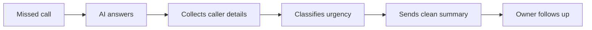

# Michael Thomas

### Founder of Cornerstone Custom AI Solutions

I build practical AI phone intake, business automation, and Azure-backed workflow systems for local businesses, service companies, and medical practices.

  
  
  

---

## What I Build

<table>
  <tr>
    <td width="50%">
      <h3>AI Phone Intake</h3>
      
Missed-call answering, caller detail capture, urgency detection, structured outputs, and owner-ready summaries.

    </td>
    <td width="50%">
      <h3>Business Automation</h3>
      
Lead routing, notifications, review queues, follow-up workflows, reporting, and CRM or job-system handoffs.

    </td>
  </tr>
  <tr>
    <td width="50%">
      <h3>Medical Admin Workflows</h3>
      
Patient intake, eligibility, referrals, prior authorization flags, scheduling dependencies, and staff review queues.

    </td>
    <td width="50%">
      <h3>Cloud Delivery</h3>
      
Azure Functions, Container Apps, Key Vault, Terraform, GitHub Actions, monitoring, and secure secret handling.

    </td>
  </tr>
</table>

## Current Build Path

## Stack

  
  
  
  
  
  
  
  
  

## Operating Principles

- Start with the business process before choosing the AI tool.
- Build small pilots that can be tested with real calls, real forms, and real staff workflows.
- Keep human review in the loop for sensitive, expensive, or high-impact decisions.
- Use structured outputs, alerts, and logs so automation can be inspected.
- Treat secrets, customer data, and operational notes carefully from day one.

## Focus Right Now

I am building repeatable automation systems for:

- Local service businesses that miss calls and need fast lead delivery.
- Medical practices with intake, scheduling, eligibility, referral, and authorization bottlenecks.
- Professional services teams that need cleaner handoffs between website forms, inboxes, and internal workflows.

Most of my current work is private client delivery, business operations, and internal platform infrastructure. Public repositories will grow around reusable automation examples, delivery templates, and practical AI workflow patterns.

## Contact

For project work or business automation questions:

- Website: [cornerstonecustomai.com](https://cornerstonecustomai.com)
- Email: [michael@cornerstonecustomai.com](mailto:michael@cornerstonecustomai.com)
